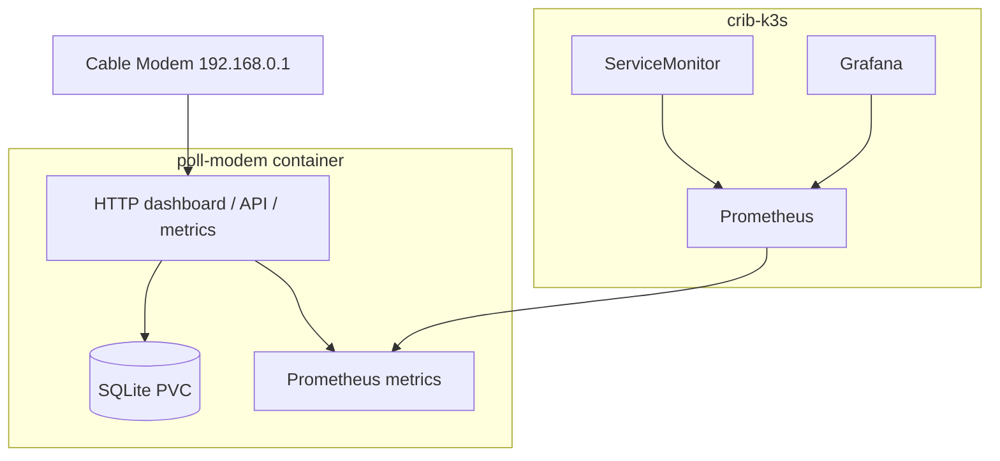

# Implementation Plan: poll-modem Metrics, Prometheus, and Grafana

## Goal

Expose useful Prometheus metrics from `poll-modem`, scrape them from the crib-k3s cluster, and visualize them in Grafana without relying on ad hoc kubectl port-forwards or manual chart installation.

The implementation should follow the existing GitOps pattern in `~/code/wesen/crib-k3s/`:

- ArgoCD owns cluster resources
- app code lives in `~/code/wesen/corporate-headquarters/poll-modem/`
- repo manifests live in `~/code/wesen/crib-k3s/gitops/`
- secrets stay out of git unless they are non-sensitive bootstrap placeholders

## Current known shape

`poll-modem` already runs as a web app in crib:

- container entrypoint: `serve`
- HTTP endpoints already exist:
  - `/` → dashboard HTML
  - `/api/status` → JSON snapshot
  - `/healthz` → health check
- current ingress: `modem.crib.scapegoat.dev`
- current TLS: shared wildcard `crib-scapegoat-dev-tls` in the `poll-modem` namespace

That means the next step is straightforward: add `/metrics` and create a scrape path for Prometheus.

## Architecture



## Rollout strategy

### Phase 1: Instrument the application

Add native Prometheus metrics to poll-modem:

- poll success/failure counters
- poll duration histogram
- last successful poll timestamp
- last failure timestamp
- current link/channel gauges
- Go runtime and process metrics

This lets us verify the application is healthy before introducing cluster monitoring components.

### Phase 2: Scrape the app from Kubernetes

Add a `ServiceMonitor` in `crib-k3s` so the monitoring stack can discover `poll-modem` automatically.

### Phase 3: Install monitoring stack via ArgoCD

Add an ArgoCD Application for a Prometheus/Grafana stack in the crib cluster.

Important constraint:
- use **ArgoCD Applications/manifests**, not local helm CLI runs
- if Helm charts are used, they must be rendered/applied by ArgoCD, not by a manual operator workflow

### Phase 4: Add Grafana access

Once Prometheus is scraping, add a Grafana access path so dashboards can be viewed through the same crib access model.

## poll-modem instrumentation plan

### Add a `/metrics` endpoint

The `serve` mode should expose `/metrics` alongside the existing dashboard routes.

Recommended metrics:

| Metric | Type | Purpose |
|--------|------|---------|
| `poll_modem_polls_total{result="success|failure"}` | counter | number of polling attempts |
| `poll_modem_poll_duration_seconds` | histogram | latency of login+fetch+store cycle |
| `poll_modem_last_success_unixtime` | gauge | last successful poll timestamp |
| `poll_modem_last_failure_unixtime` | gauge | last failed poll timestamp |
| `poll_modem_up` | gauge | last poll result (1/0) |
| `poll_modem_downstream_channels` | gauge | downstream channel count |
| `poll_modem_upstream_channels` | gauge | upstream channel count |
| `poll_modem_error_channels` | gauge | error-codeword channel count |

Also keep the default Go/process collectors enabled so we get memory/GC/CPU trends for free.

### Instrument the polling loop

The polling flow should update metrics on both success and failure:

```text
start timer
login + fetch modem HTML
store to SQLite
on success: update gauges + success counter + duration histogram
on failure: update failure counter + failure timestamp + duration histogram
```

## Scrape plan in crib-k3s

### ServiceMonitor

Create a `ServiceMonitor` in `gitops/kustomize/poll-modem/` that points at the `poll-modem` Service and scrapes `/metrics`.

Example intent:

- namespace: `poll-modem`
- service selector: `poll-modem`
- path: `/metrics`
- port: `http`

### Why ServiceMonitor instead of annotations

ServiceMonitor is better here because:

- it is explicit and reusable
- it works well with the Prometheus Operator
- it is easy to keep under GitOps
- it avoids mixing scrape configuration with application ingress concerns

## Monitoring stack plan

### Prometheus

Deploy Prometheus in crib via ArgoCD using the same namespace and automation style as the rest of the cluster.

Minimum useful configuration:

- enable Prometheus Operator support for ServiceMonitors
- watch ServiceMonitors cluster-wide or at least across application namespaces
- keep retention modest for a single-node cluster
- keep resource requests conservative

### Grafana

Deploy Grafana from the same monitoring stack or as a sibling ArgoCD app.

The simplest first-pass access strategy is:

- run Grafana in-cluster
- access it through the existing crib networking model
- add an ingress only after the datasource and dashboard path are validated

## Implementation sequence

### Step A — poll-modem app code

1. Add Prometheus client dependency
2. Add `/metrics` handler in `cmd/serve.go`
3. Add app metrics registration and updates
4. Ensure `go test ./...` passes
5. Build and publish the image to GHCR

### Step B — crib-k3s app manifests

1. Add `ServiceMonitor` manifest for poll-modem
2. Keep poll-modem ingress on the shared wildcard cert path
3. Ensure ArgoCD syncs the app cleanly

### Step C — monitoring stack

1. Add ArgoCD Application for Prometheus/Grafana stack
2. Configure it for ServiceMonitor discovery
3. Verify Prometheus sees poll-modem target
4. Verify Grafana can query Prometheus

### Step D — dashboarding

1. Create a poll-modem dashboard in Grafana
2. Add panels for polling health, signal quality, and error growth
3. Save dashboard JSON to the repo only if it is stable and reusable

## Validation checklist

### App layer

- `curl -sf http://localhost:8080/metrics` returns Prometheus text
- `poll_modem_polls_total` increments after a successful poll
- `poll_modem_up` flips to 0 on failure

### Cluster layer

- ServiceMonitor appears in Kubernetes
- Prometheus target is `UP`
- Grafana datasource points at the in-cluster Prometheus service

### GitOps layer

- ArgoCD shows the new monitoring resources as Synced
- no manual kubectl changes are needed for the steady state

## Risks / failure modes

- poll-modem may stay TUI-first and metrics could drift from the serve mode semantics
- a too-large monitoring stack could be heavy for a single-node 8GB cluster
- if Grafana is exposed publicly too early, we may need to think about auth and ingress carefully
- cert-manager/DigitalOcean rate limiting should be avoided by reusing the wildcard TLS path where possible

## Working rules

- Prefer one shared wildcard certificate for `*.crib.scapegoat.dev` if possible
- Avoid creating new cert-manager DNS01 objects unless absolutely needed
- Use ArgoCD Applications for all cluster-managed resources
- Keep the application metrics stable and low-cardinality
- Keep the first dashboard small and practical rather than trying to model every modem field
