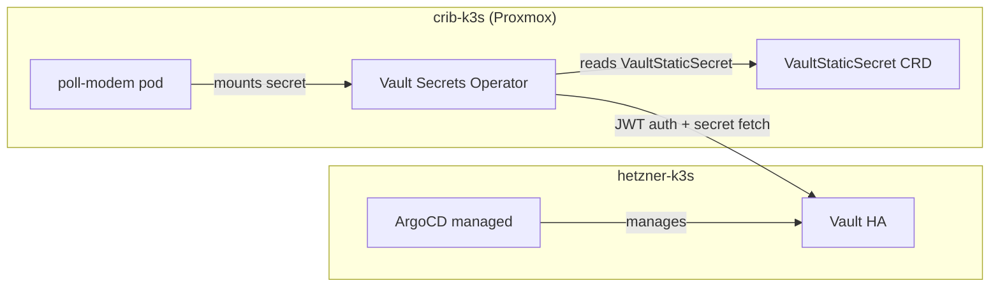

# Implementation Guide: Connect crib-k3s to Shared Hetzner Vault via VSO

## Goal

Use the existing Vault instance on the Hetzner k3s cluster (`vault.yolo.scapegoat.dev`) as the secrets backend for the crib-k3s cluster. Deploy Vault Secrets Operator (VSO) in crib-k3s, authenticate via a dedicated Kubernetes auth mount, and let ArgoCD-managed applications consume secrets via `VaultStaticSecret` CRDs.

No need to run Vault on the Proxmox box.

## Architecture



### Key difference from Hetzner VSO setup

On Hetzner, VSO talks to Vault via cluster-internal DNS (`http://vault.vault.svc.cluster.local:8200`). Crib must use the public URL (`https://vault.yolo.scapegoat.dev`) since the two clusters don't share a network.

### Auth flow

1. VSO reads a `VaultAuth` CRD specifying `method: kubernetes` and `mount: k3s-crib`
2. VSO presents the crib cluster's service account JWT to Vault at `auth/k3s-crib/login`
3. Vault validates the JWT against the crib cluster's OIDC issuer (`https://k3s-proxmox:6443` or similar)
4. Vault returns a token scoped to the role's policy
5. VSO fetches secrets from `kv/` and writes them to Kubernetes `Secret` objects

## Prerequisites

- Hetzner Vault running and accessible at `https://vault.yolo.scapegoat.dev`
- Vault root/unseal credentials (or a token with sudo on auth mounts)
- kubectl access to both clusters
- `vault` CLI installed locally

## Step 1: Deploy VSO in crib-k3s

Create an ArgoCD Application for the VSO Helm chart (same chart/version as Hetzner):

```yaml
# gitops/applications/vault-secrets-operator.yaml
apiVersion: argoproj.io/v1alpha1
kind: Application
metadata:
  name: vault-secrets-operator
  namespace: argocd
  finalizers:
    - resources-finalizer.argocd.argoproj.io
spec:
  project: default
  destination:
    server: https://kubernetes.default.svc
    namespace: vault-secrets-operator-system
  source:
    repoURL: https://helm.releases.hashicorp.com
    chart: vault-secrets-operator
    targetRevision: 1.3.0
    helm:
      releaseName: vault-secrets-operator
      values: |
        controller:
          replicas: 1
  syncPolicy:
    automated:
      prune: true
      selfHeal: true
    syncOptions:
      - CreateNamespace=true
      - ServerSideApply=true
```

## Step 2: Create Kubernetes auth mount in Vault

This is a one-time manual step. Create a **separate** auth mount for the crib cluster (don't reuse the Hetzner `kubernetes` mount — each cluster needs its own because the JWT issuer URLs differ).

```bash
export VAULT_ADDR=https://vault.yolo.scapegoat.dev
export VAULT_TOKEN=<root-token>

# Create a new kubernetes auth mount for crib
vault auth enable -path=k3s-crib kubernetes

# Configure it to trust the crib cluster's API
# Get the crib cluster's CA cert and API URL
K3S_CRIB_HOST="k3s-proxmox"  # or k3s-proxmox.tail879302.ts.net

vault write auth/k3s-crib/config \
  kubernetes_host="https://${K3S_CRIB_HOST}:6443" \
  kubernetes_ca_cert="$(kubectl --kubeconfig=../poll-modem/kubeconfig.yaml config view --raw -o jsonpath='{.clusters[0].cluster.certificate-authority-data}' | base64 -d)"
```

### Finding the crib cluster's JWT issuer

VSO uses the service account JWT. Vault needs to verify these JWTs. The issuer URL is typically the cluster's API server URL. Check with:

```bash
kubectl --kubeconfig=../poll-modem/kubeconfig.yaml get --raw /.well-known/openid-configuration | jq .issuer
```

If the issuer is an internal URL (like `https://kubernetes.default.svc.cluster.local`), you may need to configure Vault with `issuer` explicitly and set `disable_local_ca_jwt=true`.

## Step 3: Create Vault policy and role for crib

Following the same pattern as hetzner (`vault/policies/kubernetes/` and `vault/roles/kubernetes/`):

### Policy: `vault/policies/kubernetes/poll-modem.hcl`

```hcl
path "kv/data/apps/poll-modem/prod/*" {
  capabilities = ["read"]
}

path "kv/metadata/apps/poll-modem/prod/*" {
  capabilities = ["read", "list"]
}
```

### Role: `vault/roles/kubernetes/poll-modem.json`

```json
{
  "bound_service_account_names": ["poll-modem-vso"],
  "bound_service_account_namespaces": ["poll-modem"],
  "policies": ["poll-modem"],
  "ttl": "1h",
  "max_ttl": "4h"
}
```

### Bootstrap script

Adapt `scripts/bootstrap-vault-kubernetes-auth.sh` from hetzner-k3s to also handle the crib auth mount. Or run manually:

```bash
vault policy write poll-modem vault/policies/kubernetes/poll-modem.hcl
vault write auth/k3s-crib/role/poll-modem @vault/roles/kubernetes/poll-modem.json
```

## Step 4: Create VaultConnection and VaultAuth in crib-k3s

These CRDs tell VSO how to reach Vault and how to authenticate.

### Kustomize package: `gitops/kustomize/vault-connection/`

```yaml
# vault-connection.yaml
apiVersion: secrets.hashicorp.com/v1beta1
kind: VaultConnection
metadata:
  name: vault-connection
  namespace: vault-secrets-operator-system
spec:
  address: https://vault.yolo.scapegoat.dev
  skipTLSVerify: false
```

```yaml
# vault-auth.yaml
apiVersion: secrets.hashicorp.com/v1beta1
kind: VaultAuth
metadata:
  name: vault-auth
  namespace: vault-secrets-operator-system
spec:
  vaultConnectionRef: vault-connection
  method: kubernetes
  mount: k3s-crib
  kubernetes:
    role: poll-modem
    serviceAccount: poll-modem-vso
    audiences:
      - vault
```

## Step 5: Use secrets in applications

Create a `VaultStaticSecret` per application:

```yaml
# In gitops/kustomize/poll-modem/vault-static-secret.yaml
apiVersion: secrets.hashicorp.com/v1beta1
kind: VaultStaticSecret
metadata:
  name: poll-modem-credentials
  namespace: poll-modem
spec:
  vaultAuthRef: vault-secrets-operator-system/vault-auth
  mount: kv
  type: kv-v2
  path: apps/poll-modem/prod/credentials
  refreshAfter: 60s
  destination:
    name: poll-modem-credentials
    create: true
    overwrite: true
```

The poll-modem Deployment mounts this as a regular Kubernetes secret.

## Step 6: Smoke test

Follow the same pattern as hetzner's `vault-secrets-operator-smoke`:

1. Create a test namespace, service account, VaultConnection, VaultAuth, VaultStaticSecret
2. Seed a test secret in Vault: `vault kv put kv/apps/vso-crib-smoke/dev/demo username=test password=smoke`
3. Verify the secret appears in crib-k3s: `kubectl get secret vso-crib-smoke-secret -n vso-crib-smoke -o yaml`

## Migration plan for existing secrets

Currently, crib-k3s has one manually-created secret: `digitalocean-dns` in `cert-manager` namespace. After VSO is working:

1. Move the DO token into Vault: `vault kv put kv/platform/cert-manager/prod/digitalocean access-token=<token>`
2. Create a `VaultStaticSecret` for it
3. Remove the manual secret
4. Add a `VaultAuth` in `cert-manager` namespace that references the platform VaultConnection

## Files to create in crib-k3s

```
gitops/
├── applications/
│   ├── vault-secrets-operator.yaml     # Helm chart
│   └── vault-connection.yaml           # VaultConnection + VaultAuth CRDs
└── kustomize/
    ├── vault-connection/
    │   ├── kustomization.yaml
    │   ├── vault-connection.yaml
    │   └── vault-auth.yaml
    └── (per-app vault static secrets go in each app's kustomize package)

vault/
├── policies/kubernetes/
│   └── poll-modem.hcl
└── roles/kubernetes/
    └── poll-modem.json

scripts/
└── bootstrap-vault-crib-auth.sh        # One-time: create mount, policies, roles
```

## Open questions

- **Issuer URL**: The crib cluster's JWT issuer might be an internal URL that Vault can't reach. May need to configure `--service-account-issuer` in k3s or use `disable_local_ca_jwt` in Vault.
- **Network**: Vault at `vault.yolo.scapegoat.dev` resolves to `89.167.52.236` (Hetzner). VSO in crib must be able to reach it — should work since the crib VM has internet access through the cable modem.
- **Version pinning**: Pin VSO to the same version as Hetzner (`1.3.0`) for consistency.
